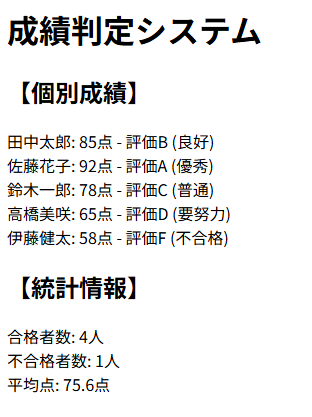

# php-control-practice

## 概要
COACHTECH 教材 Tutorial 7-2「制御構文 ハンズオン演習」で作成した成果物です。
成績判定システムを作成しました。

## 使用技術
- PHP 8.x
- Ubuntu

## 学んだこと
- foreachを使った配列の各要素を順番に処理する方法
- HTMLの書き方・演算子・関数を組み合わせたコーディング
- 平均の出し方

## 動作確認
- 文字列ごとの出力を確認してエラーが出ないか、出た時に何が出ていたのか読み解きながら修正た。

## 動作確認
